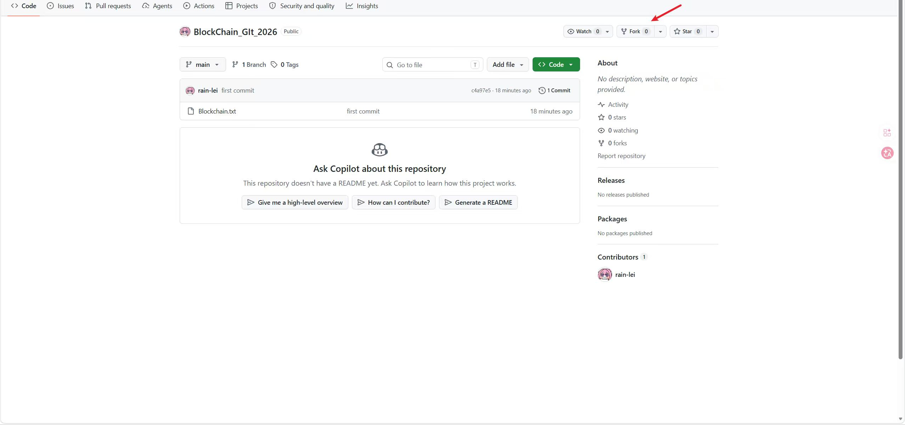
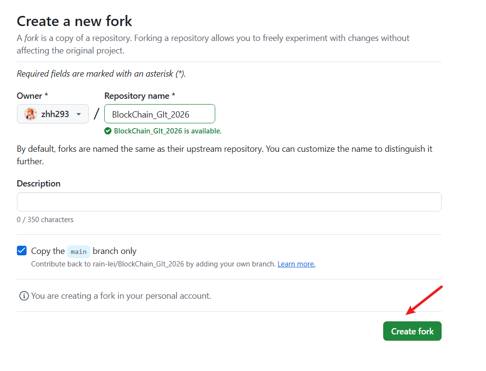
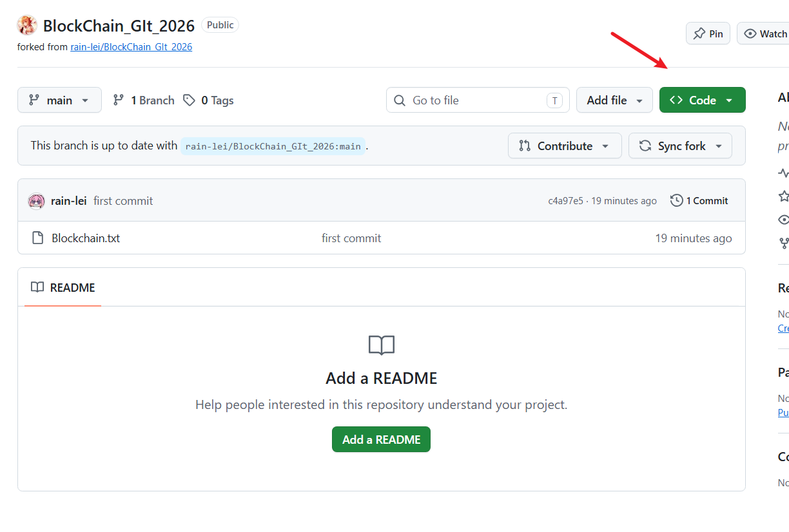
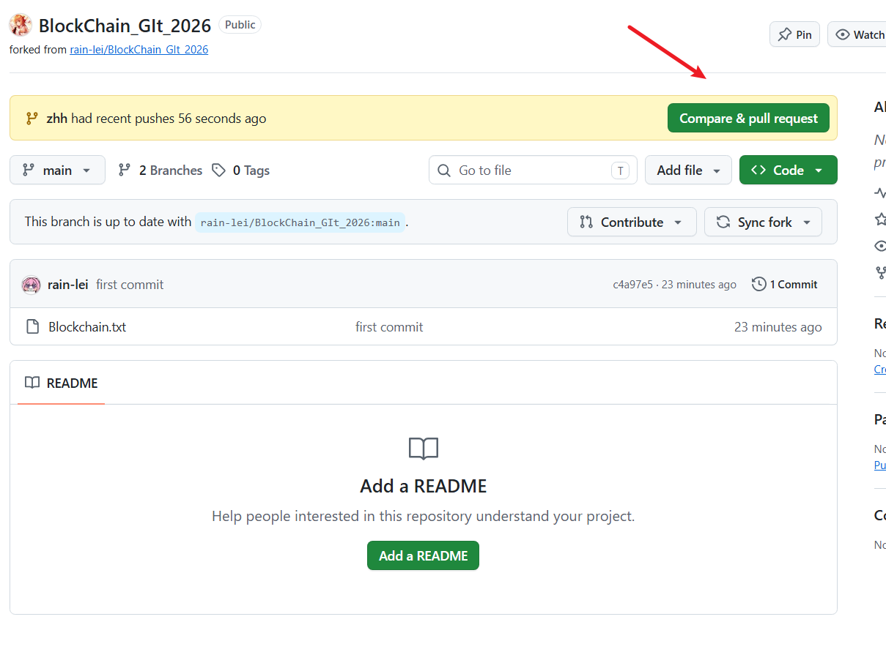
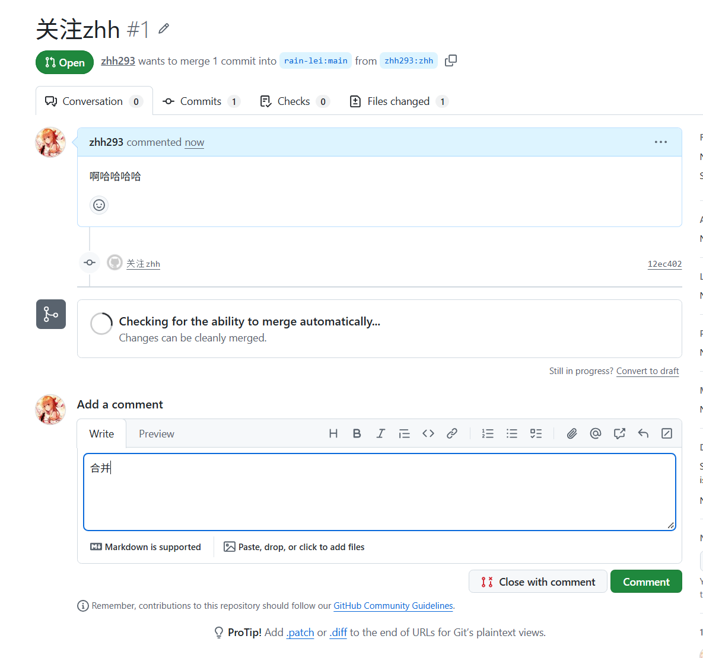

# 从 Fork 开始完成第一次 PR

## 1. Fork 仓库

打开 [原仓库](https://github.com/rain-lei/BlockChain_GIt_2026)，点击右上角 **Fork → Create fork**，将仓库复制到自己的 GitHub 账号下。



确认 Owner 是自己的账号，点击 **Create fork**。



## 2. 克隆并创建分支

在自己的 Fork 页面点击 **Code**，复制 HTTPS 克隆地址。



在终端执行，把 `YOUR_USERNAME` 换成自己的 GitHub 用户名：

```bash
git clone https://github.com/YOUR_USERNAME/BlockChain_GIt_2026.git
cd BlockChain_GIt_2026
git switch -c practice/first-pr
```

## 3. 修改并推送

用写字板输入自己喜欢的内容，以纯文本格式保存到仓库目录，文件名自定。然后执行：

```bash
git add .
git commit -m "add hello world"
git push -u origin practice/first-pr
```

这里推送到的是你自己的 Fork，无需原仓库的写入权限。

## 4. 向原仓库创建 PR

推送后，在自己的 Fork 页面点击 **Compare & pull request**。若未出现该按钮，使用下面的手动入口。



1. 打开 [原仓库的 PR 页面](https://github.com/rain-lei/BlockChain_GIt_2026/pulls)，点击 **New pull request → compare across forks**。
2. 确认合并方向：
   - **base repository**：`rain-lei/BlockChain_GIt_2026`，**base**：`main`。
   - **head repository**：你自己的 Fork，**compare**：`practice/first-pr`。
3. 检查自己的文件出现在差异中，点击 **Create pull request**。
4. 填写标题，例如“第一次PR”，再次点击 **Create pull request**。

在原仓库看到自己的 PR，就完成了！等待负责人审核并合并即可。


